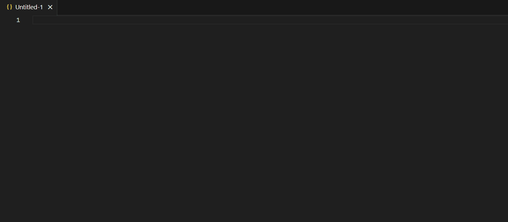

# output-module-snippets README

Output-module-snippets is a small library with code snippets to save time and effort when writing Output Module queries.

## Installation

`code --install-extension output-module-snippets-1.0.0.vsix`


## Basic Usage

Start typing any of the snippet prefixes and automatically complete the Output Module statement. Start with either `tvc` or `vc`.

Use tab to jump to snippet properties and update the default values. Some properties have multiple choices. The choices are represented as `{choice1|choice2}` in the examples below.



## Available snippets

### AND Filter

Prefix(es): filter-and

```
"Filter": {
    "AND": [
        {"Field": {"name": "", "operator": "{EQUALS|NOT_EQUALS|STARTS_WITH|NOT_STARTS_WITH|STARTS_WITH_DIGIT|ENDS_WITH|NOT_ENDS_WITH|INCLUDES|NOT_INCLUDES|LESS|GREATER|LESS_OR_EQUALS|GREATER_OR_EQUALS|BETWEEN|NULL|NOT_NULL|IN|NOT_IN|EXISTS|NOT_EXISTS}", "value": ""}}
    ]
}
```

### Asset

Prefix(es): asset, source-asset, target-asset

```
"{Asset|SourceAsset|TargetAsset}": {
    "Id": {"name": "assetId"},
    "signifier": {"name": "assetFullName"},
    "displayName": {"name": "assetDisplayName"},

}
```

### Asset Relation

A relation object where the parent node is an asset.
Prefix(es): relation-asset

```
"Relation": [
    {
        "typeId": "",
        "type": "{SOURCE|TARGET}",
        
    }
]
```

### Asset Type

Prefix(es): asset-type, source-asset-type, target-asset-type

```
"{AssetType|SourceAssetType|TargetAssetType}": {
    "Id": {"name": "assetTypeId"},
    "Name": {"name": "assetTypeName"},
    "description": {"name": "assetTypeDesc"},
    "color": {"name": "assetTypeColor"},
    "icon": {"name": "assetTypeIcon"},
    "acronym": {"name": "assetTypeAcronym"}
}
```

### Attribute

Prefix(es): attribute

```
"Attribute": {
    "labelId": "",
    "value": {"name": "attrVal"}
}
```

### Attribute Type

Prefix(es): attribute-type

```
"AttributeType": {
    "Id": {"name": "attributeTypeId"},
    "Name": {"name": "attributeTypeName"},
    "description": {"name": "attributeTypeDesc"},
    "attributeKind": {"name": "attributeTypeKind"}
}
```

### Boolean Attribute

Prefix(es): attribute-boolean

```
"BooleanAttribute": {
    "labelId": "",
    "booleanValue": {"name": "booleanAttrVal"}
}
```

### Column

Prefix(es): column, tvc-column, table-view-config-column

```
{"Column": {"fieldName": ""}}
```

### Comment

Prefix(es): comment, parent-comment

```
"{Comment|ParentComment}": {
    "content": {"name": "commentContent"}
}
```

### Community

Prefix(es): community, parent-community

```
"{Community|ParentCommunity}": {
    "Id": {"name": "communityId"},
    "Name": {"name": "communityName"}
}
```

### Created

Prefix(es): created, created-on, created-by

```
"createdOn": {"name": "createdOn"},
"createdBy": {"name": "createdBy"}
```


### Date Attribute

Prefix(es): attribute-date

```
"DateAttribute": {
    "labelId": "",
    "date": {"name": "dateAttrVal"},
    "timestamp": {"name": "dateAttrVal"}
}
```

### Date Time Attribute

Prefix(es): attribute-date-time

```
"DateTimeAttribute": {
    "labelId": "",
    "dateTime": {"name": "dateTimeAttrVal"}
}
```

### Domain

Prefix(es): domain

```
"Domain": {
    "Id": {"name": "domainId"},
    "Name": {"name": "domainName"}
}
```

### Domain Type

Prefix(es): domain-type

```
"DomainType": {
    "Id": {"name": "domainTypeId"},
    "Name": {"name": "domainTypeName"}
}
```

### Filter

Simple filter with single condition.
Prefix(es): filter

```
"Filter": {"Field": {"name": "", "operator": "{EQUALS|NOT_EQUALS|STARTS_WITH|NOT_STARTS_WITH|STARTS_WITH_DIGIT|ENDS_WITH|NOT_ENDS_WITH|INCLUDES|NOT_INCLUDES|LESS|GREATER|LESS_OR_EQUALS|GREATER_OR_EQUALS|BETWEEN|NULL|NOT_NULL|IN|NOT_IN|EXISTS|NOT_EXISTS}", "value": ""}}
```

### Filter Field

Prefix(es): filter-field

```
{"Field": {"name": "", "operator": "{EQUALS|NOT_EQUALS|STARTS_WITH|NOT_STARTS_WITH|STARTS_WITH_DIGIT|ENDS_WITH|NOT_ENDS_WITH|INCLUDES|NOT_INCLUDES|LESS|GREATER|LESS_OR_EQUALS|GREATER_OR_EQUALS|BETWEEN|NULL|NOT_NULL|IN|NOT_IN|EXISTS|NOT_EXISTS}", "value": ""}}
```

### Group

Prefix(es): group, user-group

```
"Group": {
    "Id": {"name": "groupId"},
    "groupName": {"name": "groupName"}
}
```

### Modified

Prefix(es): modified, modified-on, modified-by

```
"modifiedOn": {"name": "modifiedOn"},
"modifiedBy": {"name": "modifiedBy"}
```

### Multi Value Attribute

Prefix(es): attribute-multi-value

```
"MultiValueAttribute": {
    "labelId": "",
    "values": {"name": "attrVals"}
}
```

### Numeric Attribute

Prefix(es): attribute-numeric

```
"NumbericAttribute": {
    "labelId": "",
    "numericValue": {"name": "numericAttrVal"}
}
```

### OR Filter

Prefix(es): filter-or

```
"Filter": {
    "OR": [
        {"Field": {"name": "", "operator": "{EQUALS|NOT_EQUALS|STARTS_WITH|NOT_STARTS_WITH|STARTS_WITH_DIGIT|ENDS_WITH|NOT_ENDS_WITH|INCLUDES|NOT_INCLUDES|LESS|GREATER|LESS_OR_EQUALS|GREATER_OR_EQUALS|BETWEEN|NULL|NOT_NULL|IN|NOT_IN|EXISTS|NOT_EXISTS}", "value": ""}}
    ]
}
```

### Order

Prefix(es): order

```
"Order": [
    {"Field": {"name": "", "order": "{ASC|DESC}"}}
]
```

### Paging

Prefix(es): paging

```
"displayStart": 0,
"displayLength": 50,
"maxCountLimit": 0
```


### Relation

Prefix(es): relation

```
"Relation": {
    "RelationType": {
        "Id": {"name": "relationTypeId"},
        "role": {"name": "role"},
        "corole": {"name": "corole"},
        "description": {"name": "relationTypeDesc"}
    },
    "SourceAssetType": {
        "Id": {"name": "sourceAssetTypeId"},
        "Name": {"name": "sourceAssetTypeName"}
    },
    "TargetAssetType": {
        "Id": {"name": "targetAssetTypeId"},
        "Name": {"name": "targetAssetTypeName"}
    }
}
```

### Relation Object

Prefix(es): relation-object

```
{
    "typeId": "",
    "type": "{SOURCE|TARGET}",
    
}
```


### Relation Type

Prefix(es): relation-type

```
"RelationType": {
    "Id": {"name": "relationTypeId"},
    "role": {"name": "role"},
    "corole": {"name": "corole"},
    "description": {"name": "relationTypeDesc"}
}
```

### Responsibility

Prefix(es): responsibility

```
"Responsibility": [
    {
        "roleId": "",
        
    }
]
```

### Role

Prefix(es): role

```
"Role": {
    "Id": {"name": "roleId"},
    "Signifier": {"name": "roleName"}
}
```

### Status

Prefix(es): status

```
"Status": {
    "Id": {"name": "statusId"},
    "signifier": {"name": "statusName"}
}
```

### Table View Config

Prefix(es): tvc, table-view-config

```
{
    "TableViewConfig": {
        "Resources": {
            
        },
        "Columns": [
            {"Column": {"fieldName": ""}}
        ]
    }
}
```

### Tag

Prefix(es): tag

```
"Tag": {
    "Name": {"name": "tagName"},
    "assetsCount": {"name": "tagAssetCount"}
}
```

### User

Prefix(es): user

```
"User": {
    "linkType": "{CREATED|MODIFIED}",
    "Id": {"name": "userId"},
    "userName": {"name": "userName"},
    "firstName": {"name": "firstName"},
    "lastName": {"name": "lastName"},
    "fullName": {"name": "fullName"},
    "emailAddress": {"name": "emailAddress"}
}
```

### View Config

Prefix(es): vc, view-config

```
{
    "ViewConfig": {
        "Resources": {
            
        }
    }
}
```

### View Permission

Prefix(es): view-permission

```
"ViewPermission": {
    
}
```

## Release Notes

### 1.0.0

Initial release.
